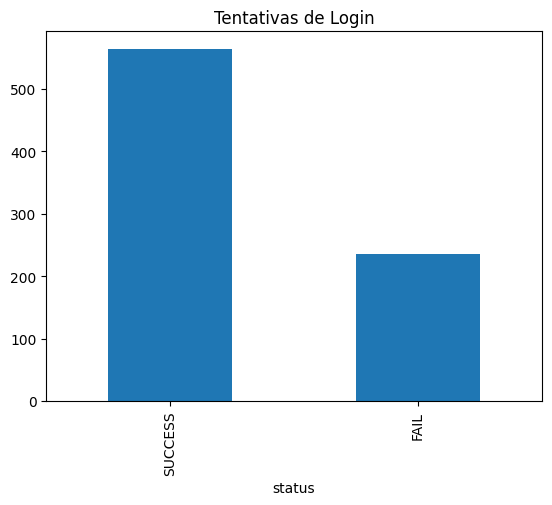
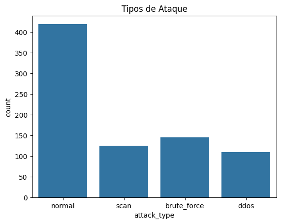
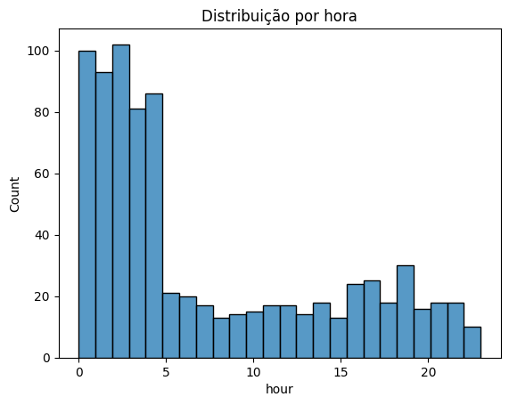
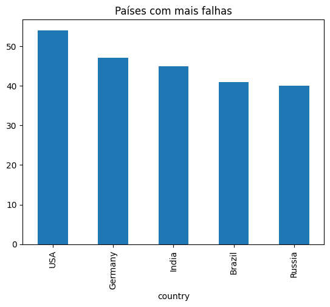
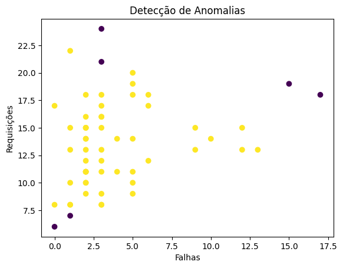

# LogGuard: Detecção Inteligente de Ameaças em Logs com IA

## Sobre o projeto

O **LogGuard** é um projeto de análise de segurança que simula um sistema de detecção de ameaças (SIEM), utilizando logs de acesso para identificar comportamentos suspeitos.

A solução combina:

* Análise de dados
* Regras de segurança
* Machine Learning (detecção de anomalias)

---

## Objetivo

Detectar possíveis ataques em logs de acesso, como:

* Ataques de força bruta (brute force)
* Comportamentos anômalos
* Atividades suspeitas em horários incomuns

---

## Tratamento de dados

O dataset foi preparado para simular cenários reais, incluindo:

* Dados faltantes (valores nulos)
* Informações inconsistentes
* Logs de diferentes tipos (auth, network, system)

Durante o processamento foram aplicadas:

* Limpeza de dados
* Padronização de datas
* Criação de variáveis (feature engineering)

---

## Análise exploratória

### Tentativas de login

---

### Tipos de ataque

---

### Distribuição por horário

---

### Países com mais falhas

---

## Detecção de ameaças

### Análise de tentativas de login

* Identificação de IPs com alta taxa de falhas
* Detecção de possíveis ataques de força bruta

### Atividade suspeita

* Acessos concentrados na madrugada
* IPs acessando múltiplos usuários

---

## Machine Learning

Foi utilizado o algoritmo **Isolation Forest** para detectar comportamentos anômalos com base em:

* Número de falhas
* Quantidade de usuários acessados
* Volume de requisições
* Atividade noturna

### Visualização de anomalias

---

## Principais insights

* Alta concentração de falhas em determinados IPs
* Atividades suspeitas predominantes durante a madrugada
* Padrões anômalos identificados automaticamente pelo modelo

---

## Tecnologias utilizadas

* Python
* Pandas
* Matplotlib
* Seaborn
* Scikit-learn

---

## Sobre o projeto

Este projeto foi desenvolvido com foco em aprendizado prático nas áreas de:

* Análise de dados
* Engenharia de dados
* Cibersegurança
* Machine Learning
